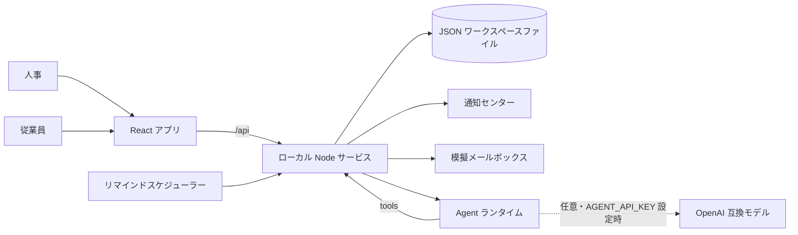

<div align="right">
  <a href="README.md"></a>
  <a href="README.ja.md"></a>
</div>

# Effective — 入社手続き（Employee Onboarding）

従業員情報フォームの周辺で何が起きるのかを探究した、個人制作のポートフォリオプロジェクトです。人事は収集する情報を定義し、新入社員を招待し、提出内容を確認します。従業員は自分専用のタスクを受け取り、下書きを保存し、内容を確認したうえで永続ストレージへ提出します。

設定可能な 3 つのセクションは、本人情報、給与振込口座情報、通勤情報です。AI アシスタントは日本語の指示から人事の作業を代行でき、定期実行のフォローアップジョブが未提出の従業員へリマインドを送ります。

本プロジェクトは合成データと独自の業務ロジックのみを用いています。マネーフォワードの製品ではなく、非公開の HRIS コードを再現したものでもありません。すべてローカル環境で動作し、クラウドアカウント、認証情報、実在のメールアドレスを一切必要としません。

## デモの実行

Node.js 22.12 以上を使用してください。

```sh
npm ci
npm run dev
```

`npm run dev` は 2 つのプロセスを同時に起動します。

| プロセス | URL | 役割 |
| --- | --- | --- |
| Vite 開発サーバー | http://127.0.0.1:5173 | React アプリ |
| ローカル API | http://127.0.0.1:8787 | ワークスペースの状態、通知、リマインド、Agent |

Vite の URL を開いてください。`npm run build && npm start` を使うと、ビルド済みアプリと API を単一の API プロセスから配信します。

### 手動で試す

1. 人事として **ワークフローを作成** を選びます。タイトル、案内文、期限を設定し、セクションを選択して必須項目を指定します。
2. 従業員向けフォームをプレビューし、テンプレートを保存します。
3. 従業員の氏名とメールアドレスをそれぞれの入力欄へ入力します。宛先を追加する場合は **従業員を追加** を使い、一覧を確認してから招待を作成します。
4. **メールを見る**、続いて **この従業員としてフォームを開く** を選ぶと、受信者側のフォームを体験できます。
5. 途中まで入力した下書きを保存し、再開し、入力済みの回答を確認して提出します。
6. 人事に戻り、提出内容を確認するか、理由を添えて差し戻します。タスク履歴も確認できます。

### Agent で試す

1. 人事として **AI アシスタント** を開きます。
2. 次のように送信します：`本人情報と給与振込口座の入社手続きフォームを作成して、田中 葵 tanaka@example.com と 小林 海 kobayashi@example.com に送ってください。期限は今月末です。`
3. アシスタントはテンプレートを作成し、両名を招待し、実行内容を報告します。新しいテンプレートとタスクは 入社手続き に即座に表示されます。
4. `未提出の従業員にリマインドを送ってください` と依頼し、**通知** ページを確認してください。

## ブラウザーでの操作の流れ

以下のスクリーンショットは、ビルド済みアプリ（`npm run build && npm start`）の実際の実行結果です。`npm run walkthrough` からヘッドレス Chrome を操作し、すべての手順で日本語を入力し、アシスタントの背後には実在の OpenAI 互換モデル（`AGENT_MODEL=deepseek-flash`）を配置しています。モデルの文面は実行ごとに変わります。`AGENT_API_KEY` を設定しない場合は、オフラインプロバイダーが固定の文面で同じ流れを実行します。値はすべて合成データです。

| ウォークスルーの入力 | 値 |
| --- | --- |
| 招待した従業員 | 山田 太郎 `yamada@example.com`、佐藤 花子 `sato@example.com` |
| 氏名 / カナ | 佐藤 花子 / サトウ ハナコ |
| 生年月日 / 住所 | 1995-04-12 / 東京都千代田区丸の内1-1-1 Effectiveビル10F |
| 銀行口座 | みずほ銀行 `0001` 丸の内支店 `001` 普通 `0012345` サトウ ハナコ |
| 通勤 | 電車・バス / 横浜駅 → 東京駅 / 東海道線（普通）/ 12,000円 |

### 1. 人事がワークスペースを開く


新規の `STATE_FILE` には、入社手続きテンプレート 1 件と合成データの従業員 2 名が初期投入されます。いずれの招待も 模擬記録済み と表示され、メールを見る から内容を開けます。人事はアシスタントに依頼せず、リマインドを実行 したり、手作業でワークフローを作成したりすることもできます。

### 2. 人事が日本語でアシスタントに依頼する


> 本人情報と給与振込口座、通勤情報の入社手続きフォームを作成して、山田 太郎 yamada@example.com と 佐藤 花子 sato@example.com に送ってください。期限は今月末です。

### 3. アシスタントがフォームを作成し、両名を招待する


モデルは `create_template` を呼び、続いて `invite_employees` を呼びました。フォーム名、3 つのセクション、期限 2026-09-30、宛先 2 名を報告し、メール送信が模擬であることを改めて明示しています。返信の下にある 2 つのチップがツール呼び出しであり、ツールの生出力が画面へ直接現れることはありません。

### 4. 受信者ごとに通知が記録される


2 件の招待が未読バッジ付きで通知センターに表示されます。本文は記録されたメッセージそのもので、タスクへのリンクと模擬送信である旨の注記を含みます。

### 5. 招待がタスク一覧に現れる


新しい 2 行が初期データの行に加わり、それぞれワークフロー、期限、ステータス、模擬送信の状態を持ちます。

### 6. 人事が記録されたメッセージを読む


表示される本文は保存済みの記録であり、テンプレートから再生成したものではありません。最終行には、実際にはメールを送信していないことが明記されています。

### 7. 人事が 佐藤 花子 としてフォームを開き、入力する


ロールを切り替えると、その従業員自身のタスクが開きます。モデルが作成した 3 セクション構成のフォームの全 19 項目を入力し、進捗表示は 18 / 18 の必須回答を示しています。必須・任意のバッジは項目一覧ではなくテンプレートに由来します。

### 8. 同じフォームをスマートフォンで表示


390 × 844 ではナビゲーションが横一列に折りたたまれ、入力欄は 1 カラムになり、追従する 一時保存 / 入力内容を確認 バーは常に操作可能な位置に留まります。

### 9. 提出前の確認では口座番号をマスクする


確認画面には 3 セクションすべてが並びます。口座番号 は `••••345` と表示され、銀行コード、支店コード、口座番号は文字列として先頭のゼロを保持しています。

### 10. 番号の表示は明示的な操作とする


口座番号を表示 を押すと `0012345` が表示され、再度隠すこともできます。

### 11. 提出により回答が永続化される


タスクは 資料は提出済みです と表示されて読み取り専用になります。回答はすでに保存されているため、再読み込みしても同じ状態が表示されます。

### 12. 人事が内容を確認し、確定する


人事は提出された回答と 提出内容の確認 パネルを参照し、理由を添えて 差し戻す か、確認を完了する のいずれかを実行できます。

### 13. 監査証跡


招待、模擬メッセージ、提出、人事による確認まで、すべての手順が記録されます。

## Agent による自動化

アシスタントはツール呼び出し型のエージェントです。データを変更できるのは 5 つのツール経由に限られ、すべてのツール呼び出しは UI と同じドメインルールを通ります。そのため、エージェントが作成したワークフローであっても、バリデーション、テンプレートの不変性、所有権チェックを迂回することはできません。

| ツール | 効果 |
| --- | --- |
| `get_workspace_overview` | テンプレートとタスク件数 |
| `list_pending_tasks` | 未提出または未確認のタスク |
| `create_template` | 新しい入社手続きテンプレート |
| `invite_employees` | 招待、通知、メールボックスへの記録（1 回の呼び出しにつき最大 20 件） |
| `send_reminders` | リマインド通知。必要に応じてモデルが記述した文面を使用 |

プロバイダーは差し替え可能です（`server/agent/provider.ts`）。

- **オフラインモック（既定）。** 決定的なルールベースのプロバイダーが、日本語と英語の限られた指示を解釈し、同じツール呼び出しを実行します。API キーもネットワークも不要です。
- **OpenAI 互換。** `AGENT_API_KEY`（および任意で `AGENT_BASE_URL`、`AGENT_MODEL`）を設定すると、DeepSeek、OpenAI、ゲートウェイ、ローカルランタイムを利用できます。`AGENT_PROVIDER=mock` を指定すると強制的にオフラインモードになります。利用可能なモデル名はアカウントごとに異なるため、まず `curl -s "$AGENT_BASE_URL/models" -H "Authorization: Bearer $AGENT_API_KEY"` で一覧を取得してください。コード上の既定値は `deepseek-chat` です。

どちらの経路も同じツールを呼び出します。DeepSeek 互換エンドポイントに対する実機確認は、複数ターンにわたるツール履歴を含めて成功しました。詳細と残課題は [docs/verification.md](docs/verification.md) に記載しています。

オフラインプロバイダーは、`…を作成して、<氏名> <メールアドレス> に送ってください` のような言い回しから、意図、メールアドレス、氏名、セクション、期限を認識します。氏名を特定できない場合はメールアドレスのローカル部を代わりに用います。これは意図的に小規模なルールエンジンであって言語モデルではありません。正確な制約は [docs/agent.md](docs/agent.md) を参照してください。

## 通知と模擬メール

- すべての招待、リマインド、修正依頼は **通知センター**（アプリ内）へ記録されます。これが信頼できるチャネルであり、未読バッジもここから算出されます。
- 同じ文面は **模擬メールボックス** にも保存され、人事はタスク一覧の **メールを見る** から参照できます。メッセージが実際に送信されることはありません。招待の本文末尾には、その記録がローカルでの模擬であることが明記されています。
- スケジューラーのティック（既定で 60 秒ごと）が、`AGENT_REMINDER_IDLE_HOURS` の間放置された、あるいは期限を過ぎた未完了タスクに対して、1 タスクあたり最大 `AGENT_REMINDER_MAX` 回までリマインドします。人事は **リマインドを実行** から即座にチェックを起動することもできます。

## 業務ルール

- テンプレートは選択したモジュールと必須項目を定義します。各招待は変更不可能なテンプレートのスナップショットを保持します。
- 1 つのテンプレートから同一のメールアドレスを招待できるのは 1 回だけです。1 バッチの宛先は最大 20 件です。
- 従業員は、UI で選択したメールアドレスに紐づくタスクにのみアクセスできます。
- 下書きでは必須回答を省略できます。提出時には選択された項目を検証し、その場で回答を保存します。スケジューラーは関与しません。
- 提出済みの回答は読み取り専用になります。人事はそれを確認するか、理由を添えて差し戻せます。差し戻されたタスクは修正と再提出が可能です。
- リマインドはタスクのデータを変更しないため、バージョンは据え置かれ、入力途中の下書きも編集可能なままです。
- 条件付きのバージョン確認により、古い状態に基づく編集は拒否されます。同一内容の再提出が履歴を重複させることはありません。
- 銀行コード、支店コード、口座番号は文字列のまま保持され、先頭のゼロが失われません。確認画面の要約では、明示的に表示操作を行うまで口座番号をマスクします。
- 配信状態とフォームの進捗は分離されています。模擬配信に失敗した場合でも、従業員タスクを作り直すことなく再送できます。

## アーキテクチャ



- `src/domain/` は共有ルール（バリデーション、状態遷移、リマインドポリシー）を保持します。UI、ストア、Agent ツールのすべてがこれを利用します。
- `src/store/` はアイソモーフィックなストアのコードで、ロールスコープ、通知、模擬配信、リマインド、単一ドキュメントの永続化を担います。
- `server/` はローカルの Node サービスで、HTTP ルート、JSON 永続化、Agent のプロバイダー / ランタイム / ツール、リマインドスケジューラーを含みます。
- `src/components/mf/` は MIT ライセンスのマネーフォワード製コンポーネント 3 点を適合させたものです（後述）。

状態は `server/.data/workspace.json`（git 管理外）に保存されます。**リセット** を実行すると、合成データの従業員 2 名の初期状態に戻ります。ローカルモードに認証機構はありません。サービスは `127.0.0.1` にバインドし、操作者は UI 上で選択します。公開インターフェースへ晒さないでください。

## 設定

`.env.example` を `.env.local` へコピーしてください。サーバーは `.env.local`、次いで `.env` を読み込み、実際の環境変数が優先されます。Vite も `VITE_*` 変数について同じファイルを読み込みます。

| 変数 | 既定値 | 用途 |
| --- | --- | --- |
| `PORT` / `HOST` | `8787` / `127.0.0.1` | API のバインドアドレス |
| `APP_URL` | `http://127.0.0.1:5173` | 通知とメールのリンクに使うベース URL |
| `STATE_FILE` | `server/.data/workspace.json` | 永続化ファイル |
| `AGENT_PROVIDER` | キー未設定時は `mock` | `mock` または `openai` |
| `AGENT_API_KEY` | — | 実在のモデルを有効化する |
| `AGENT_BASE_URL` | `https://api.deepseek.com/v1` | OpenAI 互換のベース URL |
| `AGENT_MODEL` | `deepseek-chat` | モデル名。エンドポイントが受け付ける名称は `GET $AGENT_BASE_URL/models` で確認する |
| `AGENT_TICK_SECONDS` | `60` | リマインドスケジューラーの実行間隔 |
| `AGENT_REMINDER_IDLE_HOURS` | `48` | 自動リマインドまでの放置時間。`0` の場合は次のティックでリマインドする |
| `AGENT_REMINDER_MAX` | `2` | 1 タスクあたりの自動リマインド回数 |

## マネーフォワード製コンポーネント

UI は [moneyforward/cloud-react-ui](https://github.com/moneyforward/cloud-react-ui) の **TextField**、**Block**、**StatusLabel** をローカルに適合させて利用しています。コミット `2ef9d67b4196b1178a23fe780f37cc6b652a6516` に固定し、MIT ライセンスを維持しています。適合にあたっては、styled-components によるテーマ注入をスコープ付き CSS へ置き換え、React 18 に対応させ、ネイティブのアクセシビリティとフォーカス表示を改善しました。アーカイブ済みの React 17 / Material UI 4 パッケージ全体はインストールしていません。

対象のソースファイルと変更内容の詳細は [サードパーティー通知](THIRD_PARTY_NOTICES.md) を参照してください。参考スクリーンショットは、濃色のナビゲーション、淡色のワークスペース、白基調のグループ化された従業員向けフォームという方向性の参考にしています。ブランディングは本プロジェクト独自のものです。

## 検証

```sh
npm run check
```

ESLint、フロントエンドとサーバーの TypeScript、Vitest による domain / store / Agent / API / コンポーネントのテスト、そして本番ビルドが含まれます。何を検証し、何を検証していないかは [検証ノート](docs/verification.md) に記載しています。

`npm run walkthrough` は上記のスクリーンショットを再生成します。実行には Google Chrome のインストール、`playwright-core`（すでに開発依存に含まれています）、および起動中のアプリが必要です。

```sh
rm -f /tmp/walkthrough-state.json
PORT=8799 STATE_FILE=/tmp/walkthrough-state.json APP_URL=http://127.0.0.1:8799 npm start &
npm run walkthrough -- http://127.0.0.1:8799 docs/images
```

スクリプトは最初にワークスペースを初期状態へ戻すため、繰り返し実行しても結果を比較できます。

## スコープとトレードオフ

これは単一企業を想定した小規模なデモンストレーションです。銀行情報は手入力、下書き保存は明示的な操作、人事によるレビューは 1 段階、ワークスペースの読み取りはメモリ上でのページング、保存先はデータベースではなく単一の JSON ファイルです。Agent は固定されたツールカタログ上の補助であり、汎用のワークフロー作成者ではありません。新しい項目を発明したり、配布済みのテンプレートを変更したり、アクセス権を付与したりはできません。通知の文面はテンプレートから組み立てられ、可変なのは任意でモデルが記述するリマインド文面のみです。期限の強制、ファイルアップロード、実際のメール送信、マルチテナント分離、ユーザーアカウント機構はありません。

ソースコードのコメントは英語で記述しています。README は英語版と日本語版の両方を用意しており、上部のボタンから切り替えられます。

## 公開情報への参照

- [マネーフォワード クラウド人事管理](https://biz.moneyforward.com/employee/)
- [Money Forward Cloud React UI](https://github.com/moneyforward/cloud-react-ui)
- [Money Forward frontend tools](https://github.com/moneyforward/frontend-tools)
