<div align="right">
  <a href="README.md"></a>
  <a href="README.ja.md"></a>
</div>

# Effective — Employee Onboarding

An independent portfolio project exploring what happens around an employee information form: HR defines the information to collect, invites new hires, and reviews their submissions. Employees receive an individual task, save drafts, confirm their details and submit them to persistent storage.

The three configurable sections are personal information, payroll bank-account details, and commuting information. An AI assistant can perform the HR work from a Japanese instruction, and a scheduled follow-up job reminds employees who have not submitted.

This project uses synthetic data and original business logic. It is not a Money Forward product and does not reproduce private HRIS code. It runs entirely on your machine: no cloud account, no credentials and no real email.

## Run the demo

Use Node.js 22.12 or newer.

```sh
npm ci
npm run dev
```

`npm run dev` starts both processes:

| Process | URL | Purpose |
| --- | --- | --- |
| Vite dev server | http://127.0.0.1:5173 | The React app |
| Local API | http://127.0.0.1:8787 | Workspace state, notifications, reminders and the Agent |

Open the Vite URL. `npm run build && npm start` serves the built app and the API from the single API process instead.

### Try it manually

1. As HR, select **ワークフローを作成**. Set the title, instructions and deadline, choose sections and mark required fields.
2. Preview the employee form and save the template.
3. Enter the employee name and email address in separate inputs. Use **従業員を追加** for additional recipients, review the list, and create invitations.
4. Select **メールを見る**, then **この従業員としてフォームを開く** to experience the recipient's form.
5. Save a partial draft, resume it, review completed answers, and submit.
6. Switch back to HR to confirm the submission or return it with a reason. Inspect the task history.

### Try the Agent instead

1. As HR, open **AI アシスタント**.
2. Send: `本人情報と給与振込口座の入社手続きフォームを作成して、田中 葵 tanaka@example.com と 小林 海 kobayashi@example.com に送ってください。期限は今月末です。`
3. The assistant creates the template, invites both people and reports what it did. The new template and tasks appear in 入社手続き immediately.
4. Ask `未提出の従業員にリマインドを送ってください` and check the **通知** page.

## Browser walkthrough

The screenshots below come from a real run of the built app (`npm run build && npm start`), driven by a headless Chrome through `npm run walkthrough` with Japanese input at every step and a real OpenAI-compatible model behind the assistant (`AGENT_MODEL=deepseek-flash`). Model wording varies between runs; without `AGENT_API_KEY` the offline provider performs the same flow with fixed text. Every value is synthetic.

| Walkthrough input | Value |
| --- | --- |
| Invited employees | 山田 太郎 `yamada@example.com`, 佐藤 花子 `sato@example.com` |
| Name / kana | 佐藤 花子 / サトウ ハナコ |
| Birth date / address | 1995-04-12 / 東京都千代田区丸の内1-1-1 Effectiveビル10F |
| Bank account | みずほ銀行 `0001` 丸の内支店 `001` 普通 `0012345` サトウ ハナコ |
| Commute | 電車・バス / 横浜駅 → 東京駅 / 東海道線（普通）/ 12,000円 |

### 1. HR opens the workspace

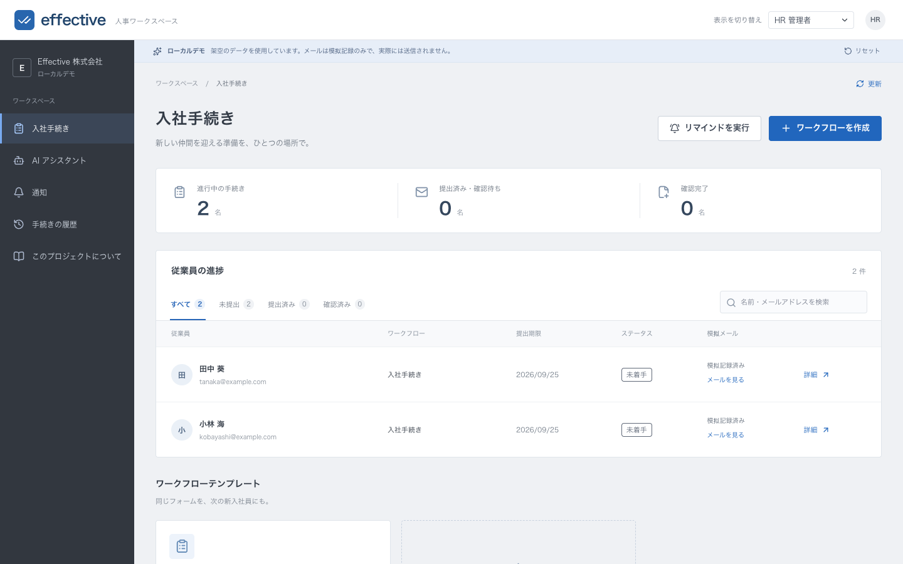

A fresh `STATE_FILE` seeds one 入社手続き template and two synthetic employees. Both invitations show 模拟記録済み and can be opened with メールを見る. HR can also run リマインドを実行 or create a workflow by hand instead of asking the assistant.

### 2. HR asks the assistant, in Japanese

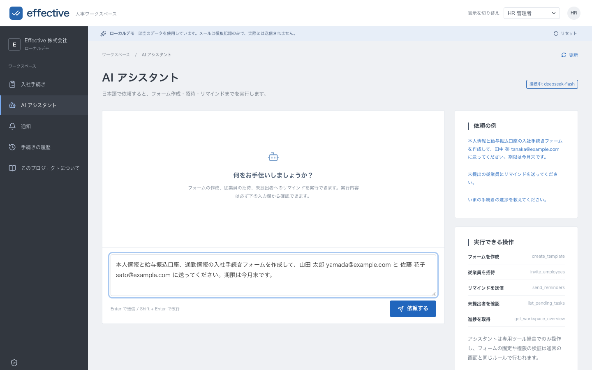

> 本人情報と給与振込口座、通勤情報の入社手続きフォームを作成して、山田 太郎 yamada@example.com と 佐藤 花子 sato@example.com に送ってください。期限は今月末です。

### 3. The assistant creates the form and invites both people

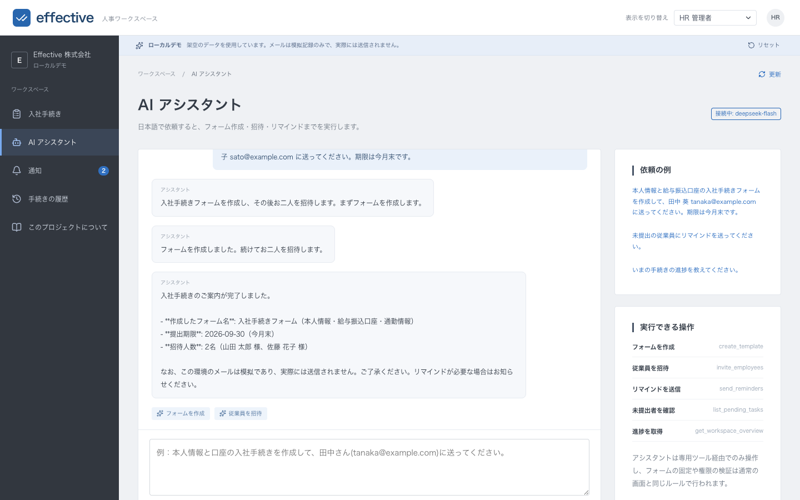

The model called `create_template` and then `invite_employees`. It reported the form name, the three sections, the deadline 2026-09-30 and 2 recipients, and restated that the mail is simulated. The two chips under the reply are the tool calls, so raw tool output never reaches the screen.

### 4. Notifications are recorded for each recipient

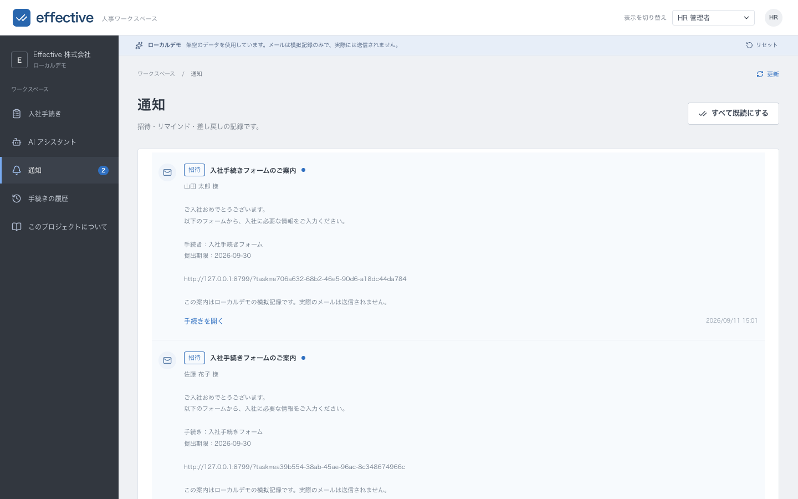

Both invitations appear in the notification centre with an unread badge. The body is the exact recorded message, including the task link and the simulated-mail disclaimer.

### 5. The invitations appear in the task list

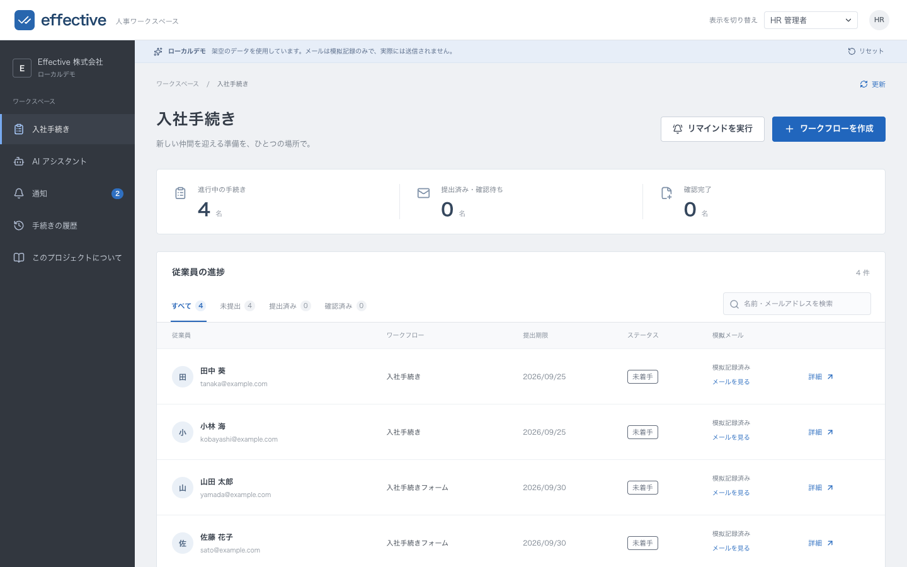

The two new rows join the seeded ones, each with its workflow, deadline, status and simulated-mail state.

### 6. HR reads the recorded message

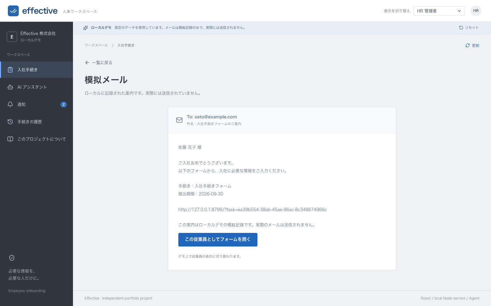

The body shown is the stored record, not a re-rendered template. The last line states that no mail was actually sent.

### 7. HR opens the form as 佐藤 花子 and fills it in

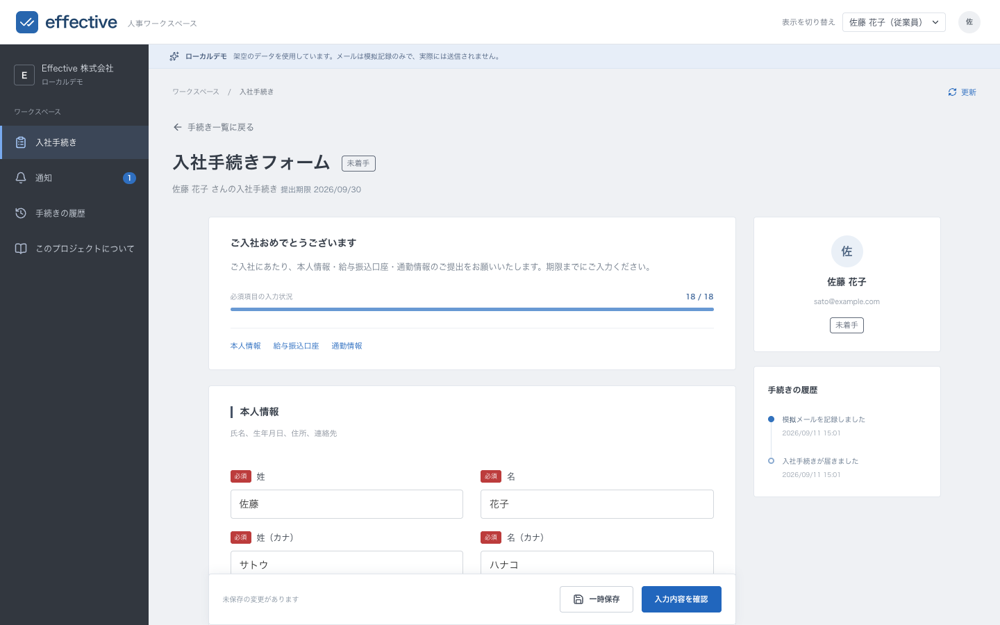

Role switching opens that employee's own task. All 19 fields of the model-created three-section form were filled; the progress indicator reads 18 / 18 required answers. Required and optional badges come from the template, not from the field list.

### 8. The same form on a phone

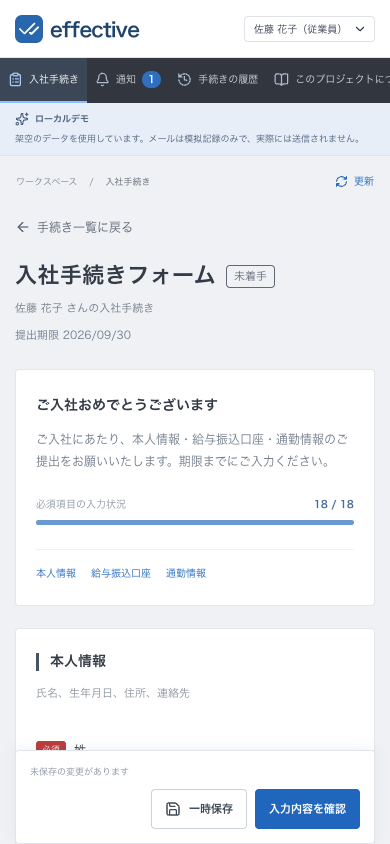

At 390 × 844 the navigation collapses to a horizontal strip, the fields become single-column and the sticky 一時保存 / 入力内容を確認 bar stays reachable.

### 9. Review before submitting masks the account number

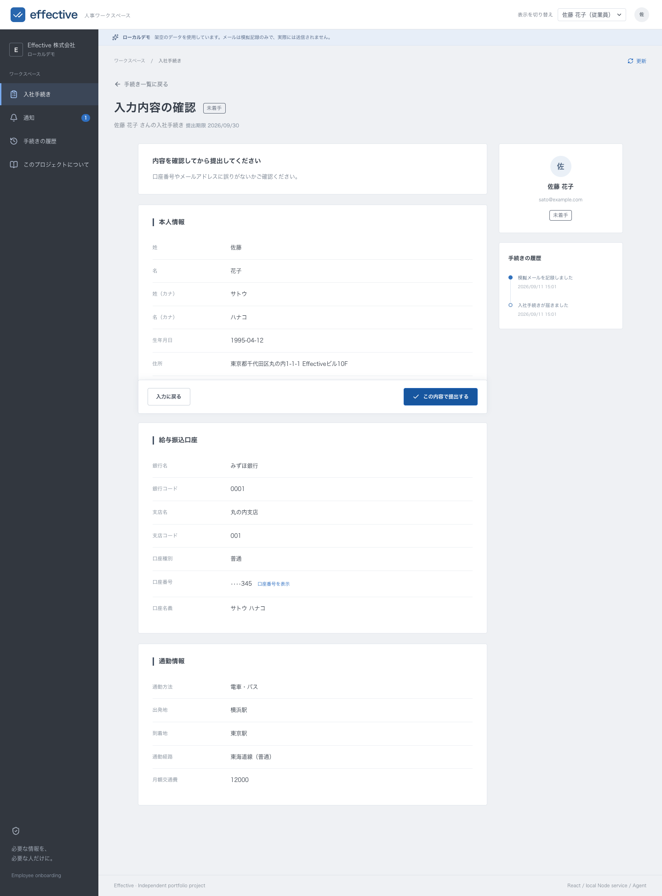

The confirmation lists all three sections. 口座番号 renders as `••••345`; the bank code, branch code and account number kept their leading zeroes as strings.

### 10. Revealing the number is an explicit action

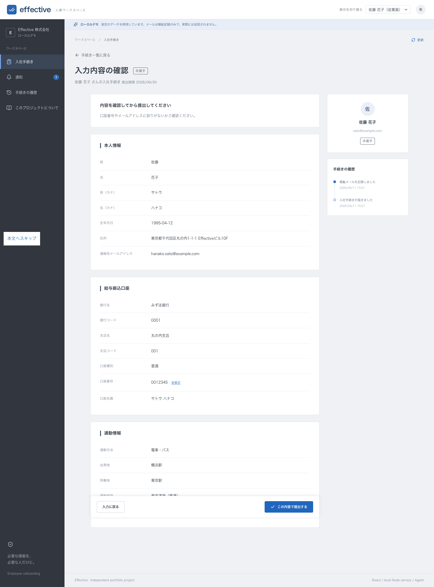

Pressing 口座番号を表示 shows `0012345` and offers to hide it again.

### 11. Submission persists the answers

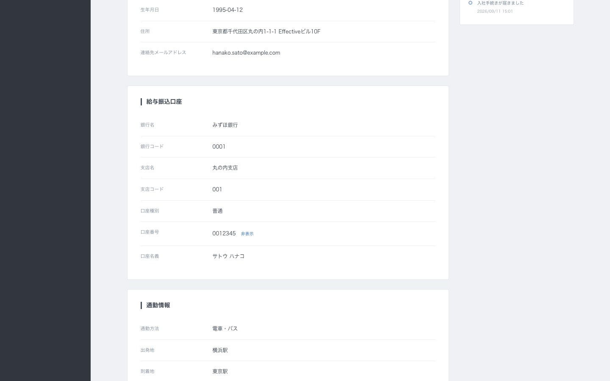

The task becomes read-only with 資料は提出済みです; the answers are already stored, so a reload shows the same state.

### 12. HR reviews and confirms

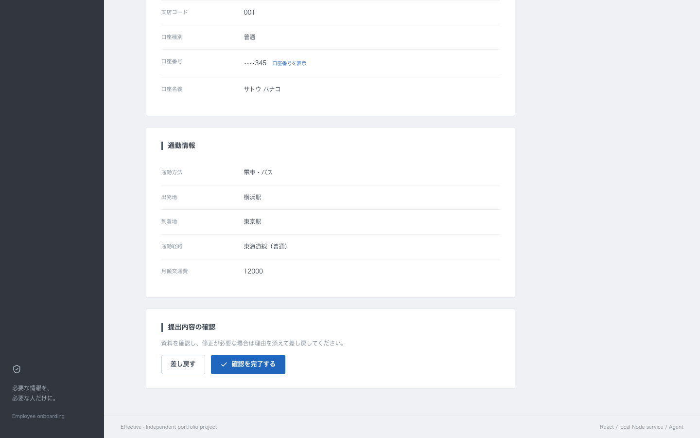

HR sees the submitted answers and the 提出内容の確認 panel, and can either 差し戻す with a reason or 確認を完了する.

### 13. The audit trail

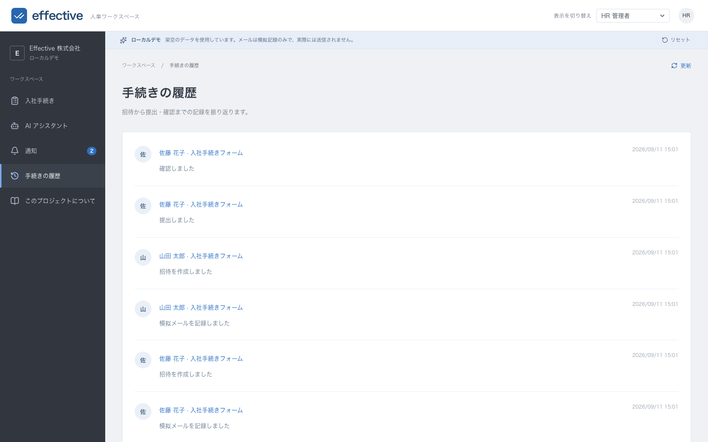

Every step is recorded: invitation, simulated message, submission and HR confirmation.

## Automation with the Agent

The assistant is a tool-calling agent. It can only change data through five tools, and every tool call runs through the same domain rules as the UI, so an agent-created workflow cannot bypass validation, template immutability or ownership checks.

| Tool | Effect |
| --- | --- |
| `get_workspace_overview` | Templates and task counts |
| `list_pending_tasks` | Tasks that are not submitted or confirmed |
| `create_template` | New onboarding template |
| `invite_employees` | Invitations, notifications and mailbox records (max 20 per call) |
| `send_reminders` | Reminder notifications, optionally with text written by the model |

Providers are pluggable (`server/agent/provider.ts`):

- **Offline mock (default).** A deterministic rule-based provider understands a small set of Japanese and English instructions and drives the same tool calls. No API key, no network.
- **OpenAI-compatible.** Set `AGENT_API_KEY` (and optionally `AGENT_BASE_URL`, `AGENT_MODEL`) to use DeepSeek, OpenAI, a gateway or a local runtime. `AGENT_PROVIDER=mock` forces offline mode. Available model names differ per account, so list them first with `curl -s "$AGENT_BASE_URL/models" -H "Authorization: Bearer $AGENT_API_KEY"`; the code default is `deepseek-chat`.

Both paths drive the same tools. A live check against a DeepSeek-compatible endpoint passed, including multi-turn tool history; the details and the remaining gaps are in [docs/verification.md](docs/verification.md).

The offline provider recognises intent, addresses, names, sections and deadlines from phrasing such as `…を作成して、<name> <email> に送ってください` and falls back to the local part of an address when it cannot find a name. It is deliberately a small rule engine, not a language model; see [docs/agent.md](docs/agent.md) for its exact limits.

## Notifications and simulated mail

- Every invitation, reminder and correction request is written to the **notification centre** (in-app). This is the reliable channel and drives the unread badge.
- The same text is stored in a **simulated mailbox** that HR can read from the task list (**メールを見る**). No message is ever sent: invitation bodies end with an explicit statement that the record is a local simulation.
- A scheduler tick (default every 60 seconds) reminds open tasks that have been idle for `AGENT_REMINDER_IDLE_HOURS` or whose deadline has passed, at most `AGENT_REMINDER_MAX` times per task. HR can also trigger the check immediately with **リマインドを実行**.

## Business rules

- Templates define selected modules and required fields. Each invitation contains an immutable template snapshot.
- Each template can invite a given email address once. A batch contains at most 20 recipients.
- Employees can access only tasks associated with the email address selected in the UI.
- Drafts may omit required answers. Submission validates the selected fields and immediately saves the answers; no scheduler is involved.
- Submitted answers become read-only. HR can confirm them or return them with a reason. Returned tasks allow correction and resubmission.
- Reminders never change task data, so the version is untouched and an in-progress draft stays editable.
- Conditional version checks reject stale edits. Identical submission retries do not duplicate history.
- Bank and branch codes and account numbers remain strings, preserving leading zeroes. Confirmation summaries mask account numbers until explicitly revealed.
- Delivery state and form progress are separate. A failed simulated delivery can be retried without creating another employee task.

## Architecture

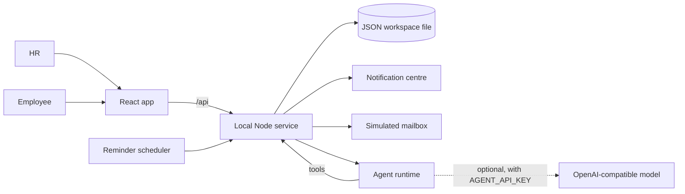

- `src/domain/` holds the shared rules: validation, transitions, reminder policy. The UI, the store and the Agent tools all use them.
- `src/store/` is isomorphic store code: role scoping, notifications, simulated delivery, reminders, single-document persistence.
- `server/` is the local Node service: HTTP routes, JSON persistence, the Agent provider/runtime/tools and the reminder scheduler.
- `src/components/mf/` adapts three MIT-licensed Money Forward components (see below).

State lives in `server/.data/workspace.json` (git-ignored). **リセット** restores the two synthetic example employees. There is no authentication in local mode: the service binds to `127.0.0.1` and the actor is chosen in the UI. Do not expose it on a public interface.

## Configuration

Copy `.env.example` to `.env.local`. The server reads `.env.local` then `.env`; real environment variables win. Vite reads the same file for `VITE_*` variables.

| Variable | Default | Purpose |
| --- | --- | --- |
| `PORT` / `HOST` | `8787` / `127.0.0.1` | API bind address |
| `APP_URL` | `http://127.0.0.1:5173` | Base URL used in notification and mail links |
| `STATE_FILE` | `server/.data/workspace.json` | Persistence file |
| `AGENT_PROVIDER` | `mock` when no key | `mock` or `openai` |
| `AGENT_API_KEY` | — | Enables a real model |
| `AGENT_BASE_URL` | `https://api.deepseek.com/v1` | OpenAI-compatible base URL |
| `AGENT_MODEL` | `deepseek-chat` | Model name; list what your endpoint accepts with `GET $AGENT_BASE_URL/models` |
| `AGENT_TICK_SECONDS` | `60` | Reminder scheduler interval |
| `AGENT_REMINDER_IDLE_HOURS` | `48` | Idle window before an automatic reminder; `0` reminds on the next tick |
| `AGENT_REMINDER_MAX` | `2` | Automatic reminders per task |

## Money Forward components

The UI locally adapts **TextField**, **Block**, and **StatusLabel** from [moneyforward/cloud-react-ui](https://github.com/moneyforward/cloud-react-ui), pinned to commit `2ef9d67b4196b1178a23fe780f37cc6b652a6516`. The MIT license is retained. Adaptations replace styled-components theme injection with scoped CSS, support React 18 and improve native accessibility and focus states. The full archived React 17 / Material UI 4 package is not installed.

See [third-party notices](THIRD_PARTY_NOTICES.md) for exact source files and changes. The reference screenshot informed the dark navigation, pale workspace and white grouped employee form; this project uses its own branding.

## Checks

```sh
npm run check
```

Checks include ESLint, frontend/server TypeScript, Vitest domain/store/Agent/API/component tests and a production build. [Verification notes](docs/verification.md) describe what was verified and what was not.

`npm run walkthrough` regenerates the screenshots above. It needs Google Chrome installed, `playwright-core` (already a dev dependency) and a running app:

```sh
rm -f /tmp/walkthrough-state.json
PORT=8799 STATE_FILE=/tmp/walkthrough-state.json APP_URL=http://127.0.0.1:8799 npm start &
npm run walkthrough -- http://127.0.0.1:8799 docs/images
```

The script resets the workspace to the seed first, so repeated runs stay comparable.

## Scope and tradeoffs

This is a small single-company demonstration. It has manual bank details, explicit draft saves, one HR review step, paginated in-memory workspace reads and a single JSON file instead of a database. The Agent is a helper over a fixed catalogue of tools, not a general workflow author: it cannot invent new fields, change shipped templates or grant access. Notification text is composed from templates; only the optional model-written reminder text varies. There is no deadline enforcement, file upload, real email transport, multi-tenant isolation or user account system.

Source-code comments are written in English. This README is available in English and Japanese; switch with the buttons at the top.

## Public references

- [Money Forward Cloud HRIS](https://biz.moneyforward.com/employee/)
- [Money Forward Cloud React UI](https://github.com/moneyforward/cloud-react-ui)
- [Money Forward frontend tools](https://github.com/moneyforward/frontend-tools)
